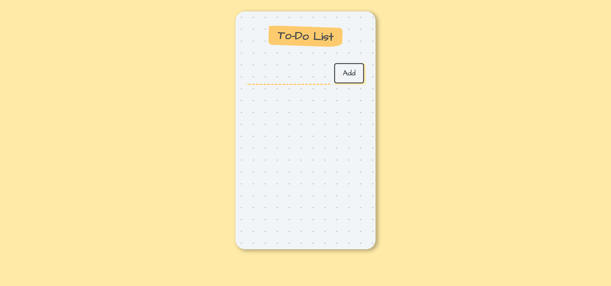

# ToDo List

This is a simple todo-list.

- A user may add to todo list, view all the tasks they have to complete, after the task is completed the user can click on the task to strike it through and the task can be deleted from the list by clicking on the 🗑️ button.

## Table of contents

- [Overview](#overview)
  - [Screenshot](#screenshot)
- [My process](#my-process)
  - [Technologies used](#technologies-used)
  - [What I learned](#what-i-learned)

## Overview

### Screenshot

## My process

### Technologies used

 

### What I learned

Learned how to do CRUD operations using react.js and the use of react hooks

